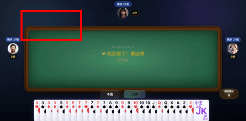

# AI掼蛋 · 开源单人 AI 掼蛋对战

> 中文名「AI掼蛋」，技术仓库名 `ai-guandan`。

> 三名大语言模型 AI 陪你打掼蛋的网页游戏。前端 React + Vite，后端 Python FastAPI，AI 出牌由大模型实时决策（非规则脚本）。

[](LICENSE)


掼蛋（Guandan）是流行于江淮地区的四人两队扑克游戏。

🌐 **不想装环境？** 直接体验在线版：https://guandan.mgarden.org.cn （浏览器即玩，自带 AI 搭子）。本项目实现完整的掼蛋规则引擎，并让三个 AI 玩家（你的对家 PartnerBot、上家 LeftBot、下家 RightBot）各自调用大模型进行出牌决策——它们会"思考"，也会犯错。



> 动图为界面演示（高亮依次扫过四个座位示意出牌轮转），基于真实牌桌截图制作。

## ✨ 特性

- **真·大模型出牌** — 每个 AI 独立配置模型与温度，决策过程可在日志中查看，非 if-else 规则脚本
- **完整掼蛋规则** — 牌型识别、级牌、逢人配（百搭）、进贡还贡、炸弹比较
- **对局复盘** — 完整历史记录（存本地 `history/`）+ 错误出牌上报（存 `errorPlay/`，gitignore 排除不入仓库），支持逐手回放
- **AI 教练点评** — 赛后由另一路模型分析你的出牌得失
- **语音与音效** — 每个角色独立语音包，出牌、炸弹、胜负均有音效
- **兼容 OpenAI 协议** — 可接 DeepSeek、Gemini、通义、本地 llama.cpp 等任意 OpenAI 兼容端点
- **开箱即用** — 无需数据库，积分默认存内存 + 浏览器 localStorage

## 🚀 快速开始

### 环境要求
- Python 3.10+
- Node.js 18+ / npm 9+
- 一个 OpenAI 兼容的大模型 API key

### 安装

```bash
git clone https://github.com/vincentlilee2/ai-guandan.git
cd ai-guandan

# 后端
python3 -m venv venv
source venv/bin/activate          # Windows: venv\Scripts\activate
pip install -r requirements.txt

# 前端
cd ui && npm install && cd ..
```

### 配置

```bash
cp .env.example .env
```

编辑 `.env`，**最少只需填三个 AI 玩家的 key**（三者可用同一个）：

```ini
PARTNERBOT_GEMINI_API_KEY=sk-your-key
PARTNERBOT_GEMINI_BASE_URL=https://api.deepseek.com
PARTNERBOT_GEMINI_MODEL=deepseek-chat
# LEFTBOT_* / RIGHTBOT_* 同理
```

> ⚠️ **命名说明**：变量名带 `GEMINI_` 是历史遗留，实际支持**任意 OpenAI 兼容端点**。填 DeepSeek / 通义 / 本地模型都可以，只要改 `BASE_URL` 和 `MODEL`。

### 运行

> 首次运行前先完成上方「安装」：`source venv/bin/activate` 已激活 venv 时，直接跑 `./start_dev.sh`。

```bash
./start_dev.sh        # 一键启动前后端（内部用 ./venv/bin/uvicorn）
```

或分别启动（venv 未激活时用带路径的 `./venv/bin/uvicorn`）：

```bash
# 后端 :8002
./venv/bin/uvicorn main:app --host 127.0.0.1 --port 8002

# 前端 :3012（另开终端）
cd ui && npm run dev -- --port 3012
```

打开 **http://127.0.0.1:3012** 开始游戏。

### 生产构建

```bash
cd ui && npm run build      # 产物在 ui/dist
./venv/bin/uvicorn main:app --port 8002
```
`ui/dist` 存在时后端会自动挂载静态资源，单进程即可对外服务。

### 用 Docker 运行（可选）

```bash
cp .env.example .env      # 填入 API key
docker compose up -d
# 打开 http://localhost:8001
```

> ⚠️ **请用 `docker compose`，不要用 `docker run --env-file .env`。**
> `--env-file` 不解析引号，若 `.env` 里写成 `BASE_URL="https://api.deepseek.com"`，
> 引号会被当成 URL 的一部分，导致 AI 静默降级为本地规则策略（日志显示"切换本地策略"）。
> `docker compose` 的 `env_file` 会正确剥除引号。

## 🧪 开发

```bash
# 后端测试
pytest                       # 50 个用例，覆盖牌型识别与结算规则

# 前端检查
cd ui
npm run lint                 # ESLint
npm run build                # 生产构建
```

## ⚡ 并发与性能限制

**请先读这一段再部署到公网。**

当前 AI 决策链路是**同步阻塞**的：每次 AI 出牌都会在 FastAPI 的线程池中
等待大模型返回（实测单次 1~90 秒，取决于模型与网络）。这带来两个硬限制：

| 限制 | 说明 |
|---|---|
| 并发对局数 | 默认上限 `GAME_MAX_ACTIVE_SESSIONS=20`。线程池默认 40 线程，每局 AI 回合会长期占用一个线程，设得过大会导致包括状态轮询在内的所有请求排队 |
| 无法多进程 | 对局状态存在进程内存中（`games` 字典），开 `--workers N` 会导致请求落到不同 worker 时找不到对局 |

**定位**：本项目当前面向**单机自娱 / 小范围试玩**设计。
若要支撑较高并发，需要两项改造：把 LLM 调用改为 `AsyncOpenAI` + 全链路 `async`，
并把对局状态外置到 Redis。欢迎 PR。

## 🏗️ 项目结构

```text
guandan/
├─ main.py                # FastAPI 入口：路由、会话、限流
├─ backend/
│  ├─ tactics.py          # 战术知识库（喂给 LLM 的决策依据）
│  ├─ ai_client.py        # AI 玩家：调模型、解析决策、重试降级
│  ├─ game_engine.py      # 对局引擎：发牌、轮转、状态机
│  ├─ rules.py            # 掼蛋规则与牌型识别
│  ├─ coach_client.py     # 赛后 AI 教练
│  ├─ llm_config.py       # 按角色读取模型配置
│  ├─ score_store.py      # 计分存储（内存 / 可选 MySQL）
│  ├─ scoring.py          # 积分规则
│  └─ models.py           # 数据模型
├─ ui/                    # React + Vite 前端
│  ├─ src/App.jsx         # 牌桌主界面
│  └─ public/             # 头像、音效、语音
├─ requirements.txt
├─ .env.example
└─ start_dev.sh
```

## 🔌 API

| 方法 | 路径 | 说明 |
|---|---|---|
| POST | `/api/start` | 开新局，返回 `game_id` 与手牌 |
| GET | `/api/{id}/state` | 对局状态（支持 `last_seq` 增量拉取） |
| GET | `/api/{id}/moves` | 当前合法出牌 |
| POST | `/api/play` | 出牌（`request_id` 幂等） |
| POST | `/api/ai_retry` | AI 决策卡住时重试 |
| GET | `/api/{id}/replay` | 对局复盘 |
| POST | `/api/report_error` | 上报异常局面 |
| GET | `/api/score` | 积分状态 |
| POST | `/api/score/sync` | 积分同步 |

前端通过 `API_BASE` 拼接（独立版默认空串，最终走 `/api/*`）。完整文档见 http://127.0.0.1:8002/docs

## ⚙️ 配置项

| 变量 | 默认 | 说明 |
|---|---|---|
| `{PARTNER,LEFT,RIGHT}BOT_GEMINI_API_KEY` | — | **必填**，各 AI 的模型 key |
| `{...}BOT_GEMINI_BASE_URL` | OpenAI | OpenAI 兼容端点 |
| `{...}BOT_GEMINI_MODEL` | — | 模型名 |
| `{...}BOT_GEMINI_TEMPERATURE` | 0.3 | 采样温度，越高越"上头" |
| `COACH_OPENAI_API_KEY` / `COACH_MODEL_NAME` | — | 赛后教练模型（可选） |
| `GAME_SESSION_TTL_SECONDS` | 7200 | 空闲对局回收时间 |
| `GAME_MAX_ACTIVE_SESSIONS` | 200 | 最大并发对局 |
| `GAME_CLEANUP_INTERVAL_SECONDS` | 300 | 清理轮询间隔 |
| `GUANDAN_DEBUG_AI` | 0 | 打印 AI 完整思考过程 |
| `GAME_DB_*` | 空 | 可选：配置后积分写 MySQL，否则用内存 |

## ❓ 常见问题

**AI 出牌很慢？**
取决于模型响应速度。实测某些模型延迟在 1~90 秒间剧烈抖动。建议选用 flash / turbo 类快速模型，或接本地 llama.cpp。

**AI 长时间不出牌？**
点界面上的重试，或调 `POST /game/ai_retry`。模型偶尔会返回无法解析的内容，客户端有重试与降级。

**模型返回 403 / 401？**
检查 key 是否有效、`BASE_URL` 是否匹配该厂商、是否有地域限制。可先只配 PartnerBot 验证连通性。

**依赖装不上 / 导入报错？**
确认虚拟环境已激活。若用了会注入 `PYTHONPATH` 的工具链，命令前加 `env -u PYTHONPATH`。

**esbuild 报平台不匹配？**
删除 `ui/node_modules` 后重装；若 npm 拦截了安装脚本，执行 `npm install-scripts approve esbuild && npm rebuild esbuild`。

## 🔒 安全

- `.env` 已在 `.gitignore` 中，**切勿提交**
- 对局 ID 使用高熵随机值，避免枚举
- 内置接口限流与会话数上限
- 公网部署时建议置于反向代理之后，并按内存调低 `GAME_MAX_ACTIVE_SESSIONS`

## 🗺️ Roadmap

- [ ] API 路由前缀由 `/game` 统一为 `/api`
- [ ] 联机对战（人类玩家互相对打）
- [ ] AI 难度分级与人格化配置
- [ ] Docker 一键部署
- [ ] 官方平台：胜率榜 / 自训 AI 玩家上传与对战

## 🙏 致谢

本项目最初是一个定制旅游平台的内嵌小游戏，2026 年剥离为独立开源项目。

🔗 在线体验：https://guandan.mgarden.org.cn

📦 仓库说明：`vincentlilee2/ai-guandan`（本仓库）为**开源分发版**；另有私有仓库用于服务器端生产更新，两者代码同源。

## License（自定义受限许可）

本项目采用**自定义受限许可**（非标准 OSI 开源协议），核心条款：

- ✅ 允许：个人学习 / 娱乐 / 本地运行、fork、镜像、自行部署、修改
- ✅ 允许：将你生成的「对战成绩 / 训练心得 / 自训 AI 玩家」上传至官方平台
- ❌ 禁止：商业用途（须版权人书面授权）、将本软件本身闭源或二次分发
- ❌ 禁止：移除版权署名

完整条款见 [LICENSE](LICENSE)。

> 仓库原以 MIT 发布的历史版本，对已 fork 者仍按 MIT 生效；本许可仅对未来下载者生效。
